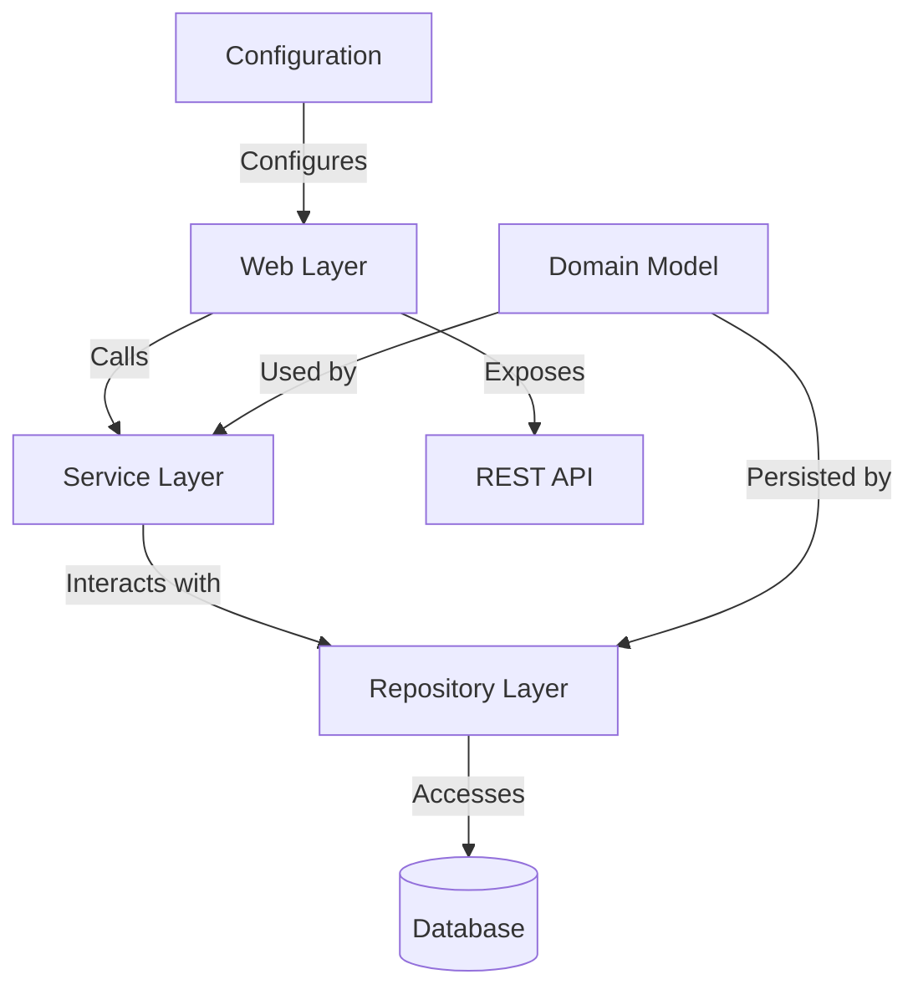
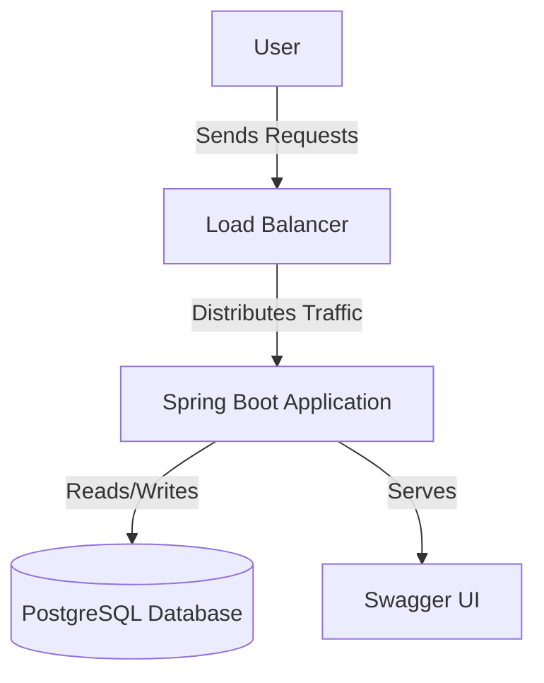
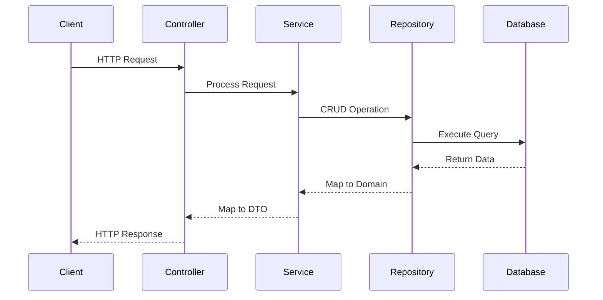
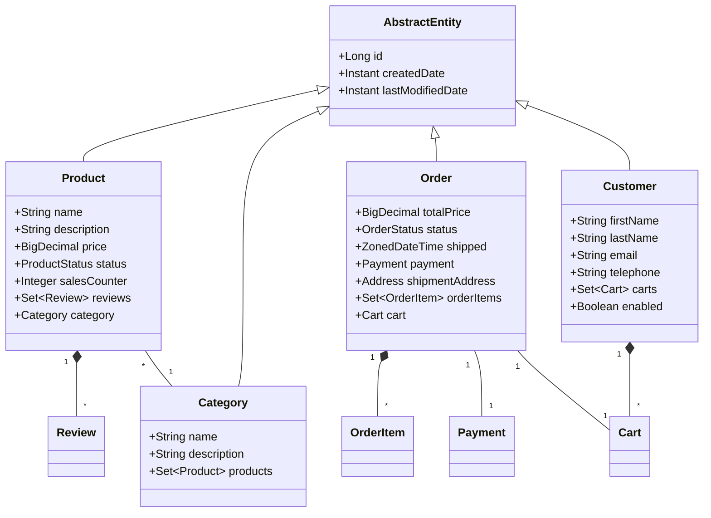
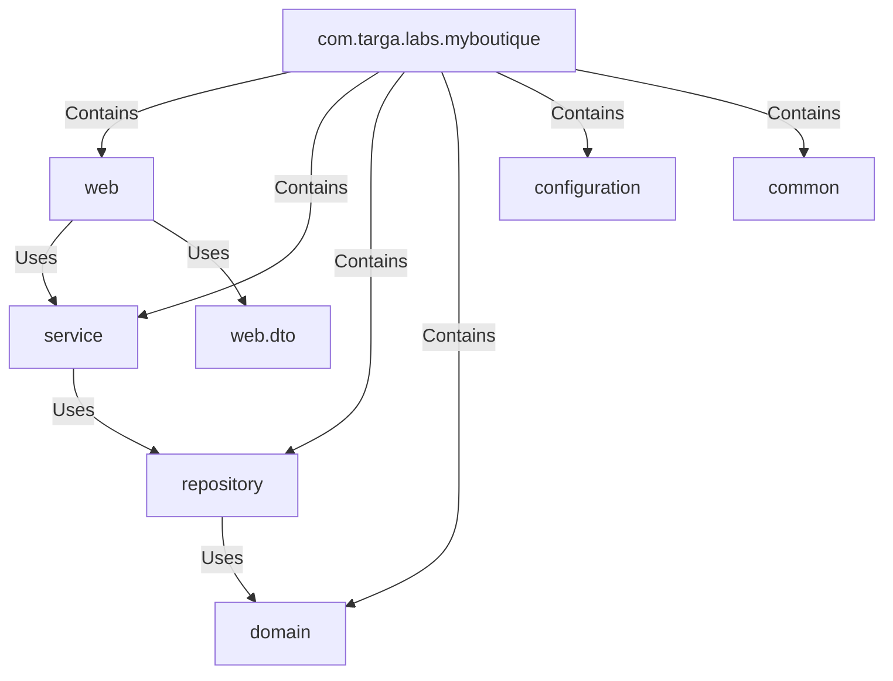
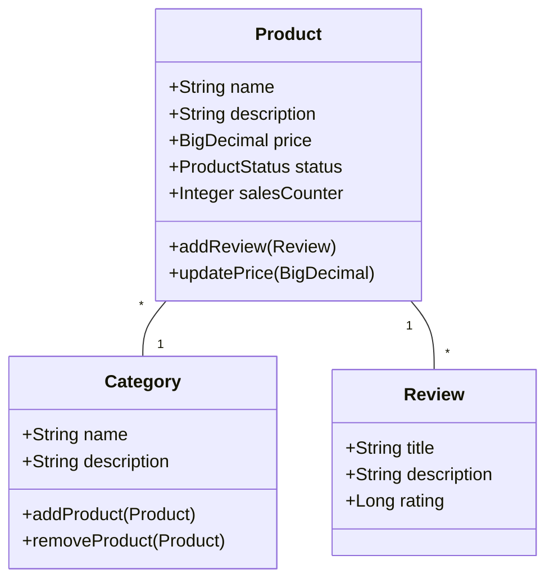
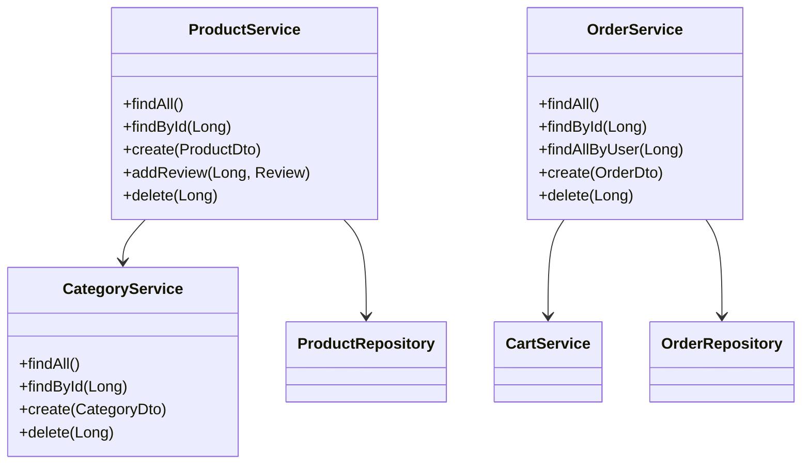
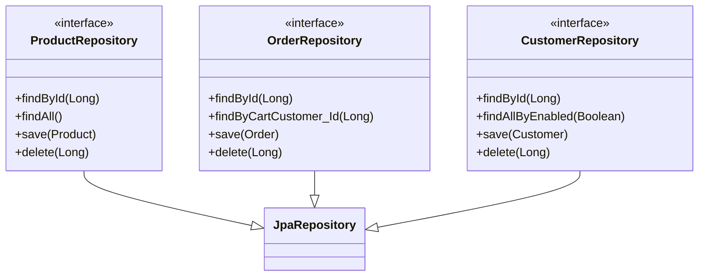
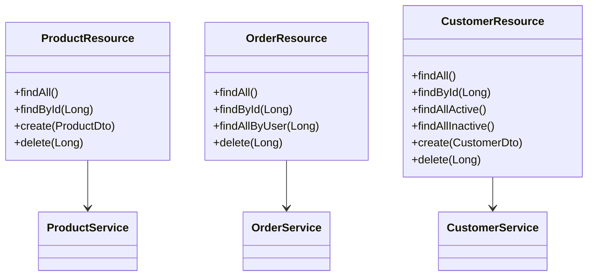

# Estructura de Carpetas del Proyecto Backend

## Estructura Principal

```
src/
├── main/
│   ├── java/
│   │   └── com/targa/labs/myboutique/
│   │       ├── MyboutiqueApplication.java            # Clase principal de la aplicación Spring Boot
│   │       │
│   │       ├── common/                              # Utilidades y clases comunes
│   │       │   └── Web.java                         # Constantes para endpoints de la API
│   │       │
│   │       ├── configuration/                       # Configuraciones de la aplicación
│   │       │   └── SwaggerConfiguration.java        # Configuración de Swagger para documentación de API
│   │       │
│   │       ├── domain/                             # Entidades y modelos de dominio
│   │       │   ├── AbstractEntity.java             # Clase base con campos comunes para todas las entidades
│   │       │   ├── Address.java                    # Entidad para gestionar direcciones
│   │       │   ├── Cart.java                       # Entidad de carritos de compra
│   │       │   ├── Category.java                   # Entidad de categorías de productos
│   │       │   ├── Customer.java                   # Entidad de clientes
│   │       │   ├── Order.java                      # Entidad de órdenes/pedidos
│   │       │   ├── OrderItem.java                  # Entidad de items en una orden
│   │       │   ├── Payment.java                    # Entidad de pagos
│   │       │   ├── Product.java                    # Entidad de productos
│   │       │   ├── Review.java                     # Entidad de reseñas
│   │       │   └── enumeration/                    # Enumeraciones del dominio
│   │       │       ├── CartStatus.java             # Estados posibles de un carrito
│   │       │       ├── OrderStatus.java            # Estados posibles de una orden
│   │       │       ├── PaymentStatus.java          # Estados posibles de un pago
│   │       │       └── ProductStatus.java          # Estados posibles de un producto
│   │       │
│   │       ├── repository/                         # Capa de acceso a datos
│   │       │   ├── CartRepository.java             # Repositorio para operaciones CRUD de carritos
│   │       │   ├── CategoryRepository.java         # Repositorio para operaciones CRUD de categorías
│   │       │   ├── CustomerRepository.java         # Repositorio para operaciones CRUD de clientes
│   │       │   ├── OrderItemRepository.java        # Repositorio para operaciones CRUD de items de orden
│   │       │   ├── OrderRepository.java            # Repositorio para operaciones CRUD de órdenes
│   │       │   ├── PaymentRepository.java          # Repositorio para operaciones CRUD de pagos
│   │       │   ├── ProductRepository.java          # Repositorio para operaciones CRUD de productos
│   │       │   └── ReviewRepository.java           # Repositorio para operaciones CRUD de reseñas
│   │       │
│   │       ├── service/                           # Capa de lógica de negocio
│   │       │   ├── AddressService.java            # Servicio para gestión de direcciones
│   │       │   ├── CartService.java               # Servicio para gestión de carritos
│   │       │   ├── CategoryService.java           # Servicio para gestión de categorías
│   │       │   ├── CustomerService.java           # Servicio para gestión de clientes
│   │       │   ├── OrderItemService.java          # Servicio para gestión de items de orden
│   │       │   ├── OrderService.java              # Servicio para gestión de órdenes
│   │       │   ├── PaymentService.java            # Servicio para gestión de pagos
│   │       │   ├── ProductService.java            # Servicio para gestión de productos
│   │       │   └── ReviewService.java             # Servicio para gestión de reseñas
│   │       │
│   │       └── web/                              # Capa de presentación (API REST)
│   │           ├── CartResource.java             # Controlador REST para carritos
│   │           ├── CategoryResource.java         # Controlador REST para categorías
│   │           ├── CustomerResource.java         # Controlador REST para clientes
│   │           ├── OrderItemResource.java        # Controlador REST para items de orden
│   │           ├── OrderResource.java            # Controlador REST para órdenes
│   │           ├── PaymentResource.java          # Controlador REST para pagos
│   │           ├── ProductResource.java          # Controlador REST para productos
│   │           ├── ReviewResource.java           # Controlador REST para reseñas
│   │           └── dto/                          # Objetos de transferencia de datos
│   │               ├── AddressDto.java           # DTO para transferencia de datos de direcciones
│   │               ├── CartDto.java              # DTO para transferencia de datos de carritos
│   │               ├── CategoryDto.java          # DTO para transferencia de datos de categorías
│   │               ├── CustomerDto.java          # DTO para transferencia de datos de clientes
│   │               ├── OrderDto.java             # DTO para transferencia de datos de órdenes
│   │               ├── OrderItemDto.java         # DTO para transferencia de datos de items de orden
│   │               ├── PaymentDto.java           # DTO para transferencia de datos de pagos
│   │               ├── ProductDto.java           # DTO para transferencia de datos de productos
│   │               └── ReviewDto.java            # DTO para transferencia de datos de reseñas
│   │
│   └── resources/
│       ├── application.properties                # Configuración de la aplicación Spring Boot
│       └── db/migration/
│           └── V1__init_app.sql                 # Script de inicialización de la base de datos
│
└── test/                                        # Carpeta de pruebas
    └── java/
        └── com/targa/labs/myboutique/
            ├── domain/                          # Pruebas unitarias de entidades
            └── service/                         # Pruebas unitarias de servicios
                └── AddressServiceTest.java      # Pruebas del servicio de direcciones
```

## Descripción de la Arquitectura

Esta estructura de carpetas refleja una arquitectura en capas típica de una aplicación Spring Boot:

1. **Capa de Presentación (`web/`)**
   - Controladores REST que exponen la API
   - DTOs para la transferencia de datos
   - Manejo de peticiones y respuestas HTTP

2. **Capa de Servicios (`service/`)**
   - Implementación de la lógica de negocio
   - Orquestación de operaciones
   - Transformación entre entidades y DTOs

3. **Capa de Repositorios (`repository/`)**
   - Interfaces para acceso a datos
   - Extensión de JpaRepository para operaciones CRUD
   - Queries personalizadas

4. **Capa de Dominio (`domain/`)**
   - Entidades JPA
   - Enumeraciones
   - Lógica de dominio

5. **Configuración y Utilidades**
   - Configuración de Spring Boot
   - Configuración de Swagger
   - Clases utilitarias
   - Scripts de base de datos

La aplicación sigue los principios de:
- Separación de responsabilidades
- Inversión de control (IoC)
- Inyección de dependencias
- Patrón Repository
- Patrón DTO

# Diagramas de Arquitectura

## Diagrama de Componentes


## Diagrama de Despliegue


## Diagrama de Flujo de Datos


## Diagrama de Clases Principal


## Diagrama de Paquetes


## Diagramas de Clases por Carpeta

### Carpeta `domain`


### Carpeta `service`


### Carpeta `repository`


### Carpeta `web` (Controllers)
