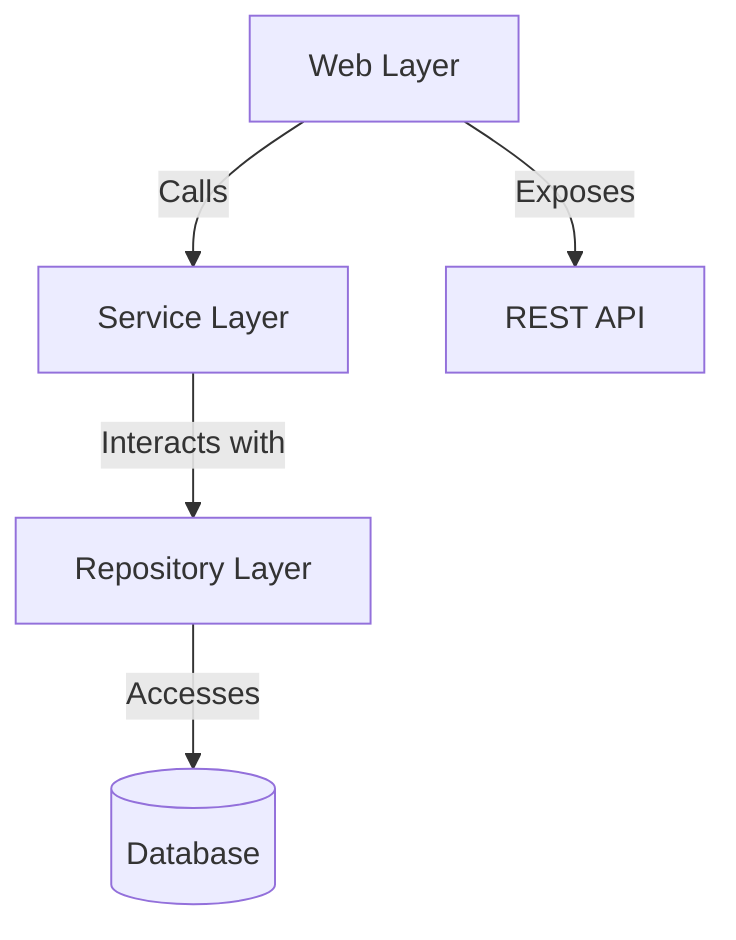
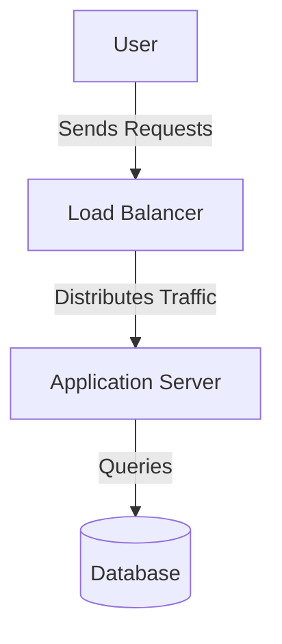
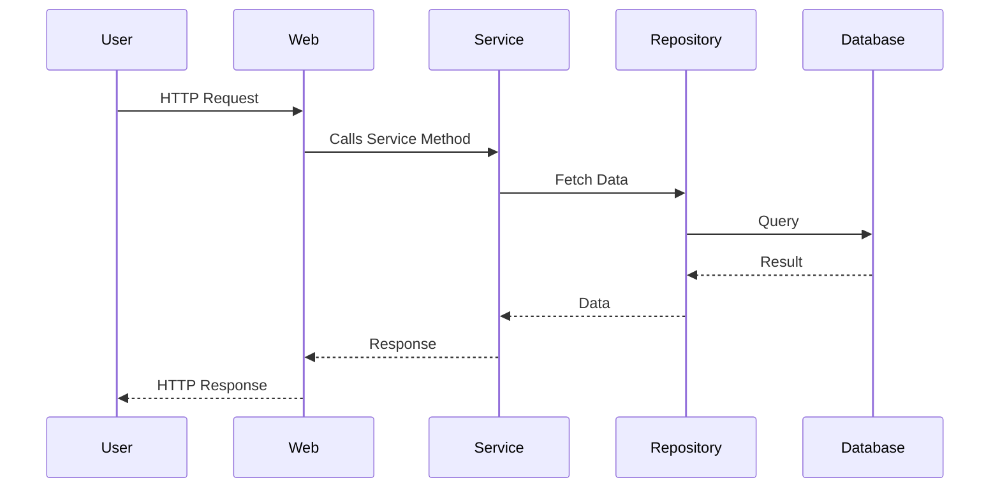
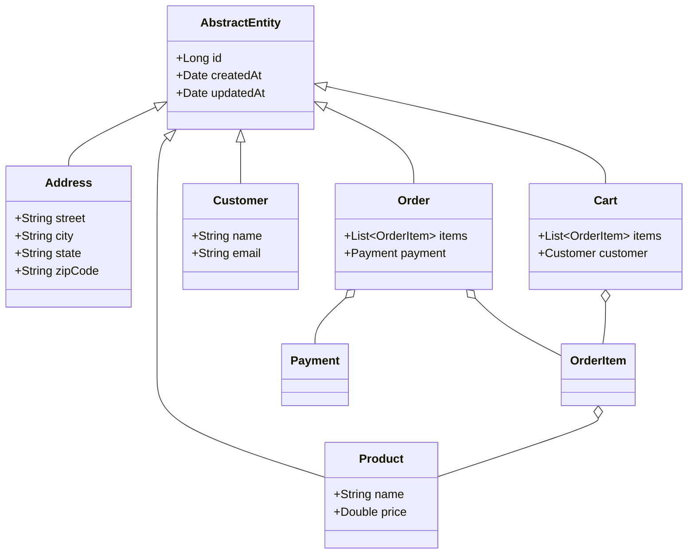
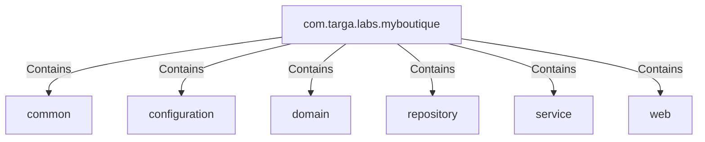
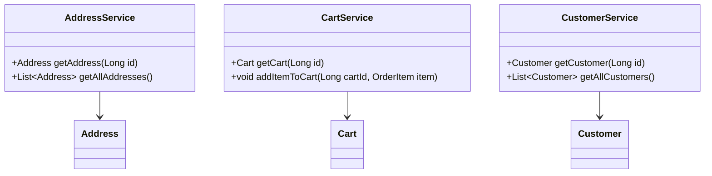
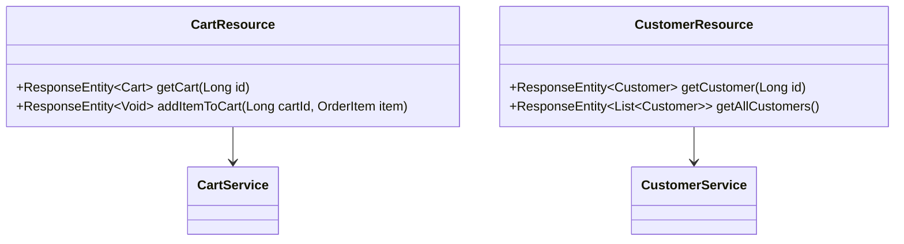
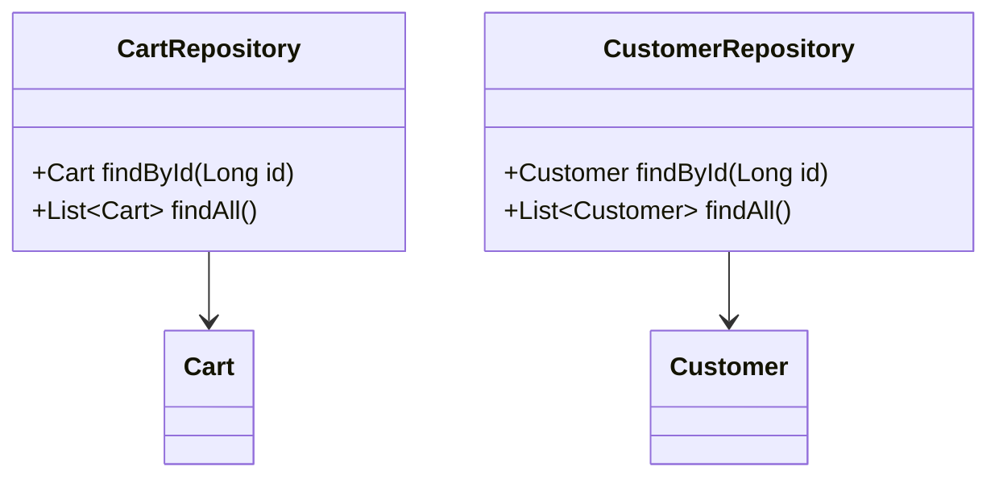

# Estructura de Carpetas del Proyecto Backend

## Estructura Principal

```
/Users/rojo/MISO/playing-with-java-microservices-monolith-example
│
├── architecture.md  # Análisis de la arquitectura del proyecto.
├── pom.xml           # Archivo de configuración de Maven.
├── README.md         # Documentación general del proyecto.
├── src/
│   ├── main/
│   │   ├── java/
│   │   │   └── com/targa/labs/myboutique/
│   │   │       ├── MyboutiqueApplication.java  # Clase principal para iniciar la aplicación Spring Boot.
│   │   │       ├── common/                     # Clases comunes y utilitarias.
│   │   │       ├── configuration/             # Configuraciones de la aplicación.
│   │   │       │   └── SwaggerConfiguration.java  # Configuración de Swagger para la documentación de la API.
│   │   │       ├── domain/                    # Entidades del modelo de datos.
│   │   │       │   ├── AbstractEntity.java    # Clase base para todas las entidades con atributos comunes.
│   │   │       │   ├── Address.java           # Entidad que representa una dirección.
│   │   │       │   ├── Cart.java              # Entidad que representa un carrito de compras.
│   │   │       │   ├── Category.java          # Entidad que representa una categoría de productos.
│   │   │       │   ├── Customer.java          # Entidad que representa un cliente.
│   │   │       │   ├── Order.java             # Entidad que representa un pedido.
│   │   │       │   ├── OrderItem.java         # Entidad que representa un ítem dentro de un pedido.
│   │   │       │   ├── Payment.java           # Entidad que representa un pago.
│   │   │       │   ├── Product.java           # Entidad que representa un producto.
│   │   │       │   ├── Review.java            # Entidad que representa una reseña de producto.
│   │   │       │   └── enumeration/           # Enumeraciones utilizadas en las entidades.
│   │   │       ├── repository/                # Repositorios para acceso a datos.
│   │   │       │   ├── CartRepository.java    # Repositorio para la entidad Cart.
│   │   │       │   ├── CategoryRepository.java # Repositorio para la entidad Category.
│   │   │       │   ├── CustomerRepository.java # Repositorio para la entidad Customer.
│   │   │       │   ├── OrderItemRepository.java # Repositorio para la entidad OrderItem.
│   │   │       │   ├── OrderRepository.java   # Repositorio para la entidad Order.
│   │   │       │   ├── PaymentRepository.java # Repositorio para la entidad Payment.
│   │   │       │   ├── ProductRepository.java # Repositorio para la entidad Product.
│   │   │       │   └── ReviewRepository.java  # Repositorio para la entidad Review.
│   │   │       ├── service/                   # Servicios con la lógica de negocio.
│   │   │       │   ├── AddressService.java    # Servicio para gestionar direcciones.
│   │   │       │   ├── CartService.java       # Servicio para gestionar carritos de compras.
│   │   │       │   ├── CategoryService.java   # Servicio para gestionar categorías.
│   │   │       │   ├── CustomerService.java   # Servicio para gestionar clientes.
│   │   │       │   ├── OrderItemService.java  # Servicio para gestionar ítems de pedidos.
│   │   │       │   ├── OrderService.java      # Servicio para gestionar pedidos.
│   │   │       │   ├── PaymentService.java    # Servicio para gestionar pagos.
│   │   │       │   ├── ProductService.java    # Servicio para gestionar productos.
│   │   │       │   └── ReviewService.java     # Servicio para gestionar reseñas.
│   │   │       ├── web/                       # Controladores para la API REST.
│   │   │       │   ├── CartResource.java      # Controlador para gestionar carritos de compras.
│   │   │       │   ├── CategoryResource.java  # Controlador para gestionar categorías.
│   │   │       │   ├── CustomerResource.java  # Controlador para gestionar clientes.
│   │   │       │   ├── OrderItemResource.java # Controlador para gestionar ítems de pedidos.
│   │   │       │   ├── OrderResource.java     # Controlador para gestionar pedidos.
│   │   │       │   ├── PaymentResource.java   # Controlador para gestionar pagos.
│   │   │       │   ├── ProductResource.java   # Controlador para gestionar productos.
│   │   │       │   ├── ReviewResource.java    # Controlador para gestionar reseñas.
│   │   │       │   └── dto/                   # Objetos de transferencia de datos.
│   │   ├── resources/
│   │   │   ├── application.properties         # Configuración de la aplicación.
│   │   │   └── db/migration/
│   │   │       └── V1__init_app.sql           # Script de inicialización de la base de datos.
│   ├── test/
│   │   ├── java/
│   │   │   └── com/targa/labs/myboutique/
│   │   │       ├── domain/                    # Pruebas para las entidades del dominio.
│   │   │       └── service/                   # Pruebas para los servicios.
│   │   │           └── AddressServiceTest.java # Prueba unitaria para AddressService.
├── target/                                    # Archivos generados por Maven.
```

## Descripción de Carpetas y Archivos

- **architecture.md:** Contiene el análisis de la arquitectura del proyecto.
- **pom.xml:** Archivo de configuración de Maven para gestionar dependencias y plugins.
- **README.md:** Documentación general del proyecto.
- **src/main/java:** Código fuente principal de la aplicación.
  - **MyboutiqueApplication.java:** Clase principal para iniciar la aplicación Spring Boot.
  - **common:** Clases comunes y utilitarias.
  - **configuration:** Configuraciones de la aplicación, como Swagger.
  - **domain:** Entidades del modelo de datos.
  - **repository:** Repositorios para acceso a datos.
  - **service:** Servicios con la lógica de negocio.
  - **web:** Controladores y DTOs para la API REST.
- **src/main/resources:** Recursos de la aplicación, como configuración y scripts de base de datos.
- **src/test/java:** Pruebas unitarias y de integración.
- **target:** Archivos generados por Maven, como clases compiladas y recursos empaquetados.

# Diagramas de Arquitectura

## Diagrama de Componentes


## Diagrama de Despliegue


## Diagrama de Flujo de Datos


## Diagrama de Clases


## Diagrama de Paquetes


## Diagramas de Clases por Carpeta

### Carpeta `domain`


### Carpeta `service`


### Carpeta `web`


### Carpeta `repository`
